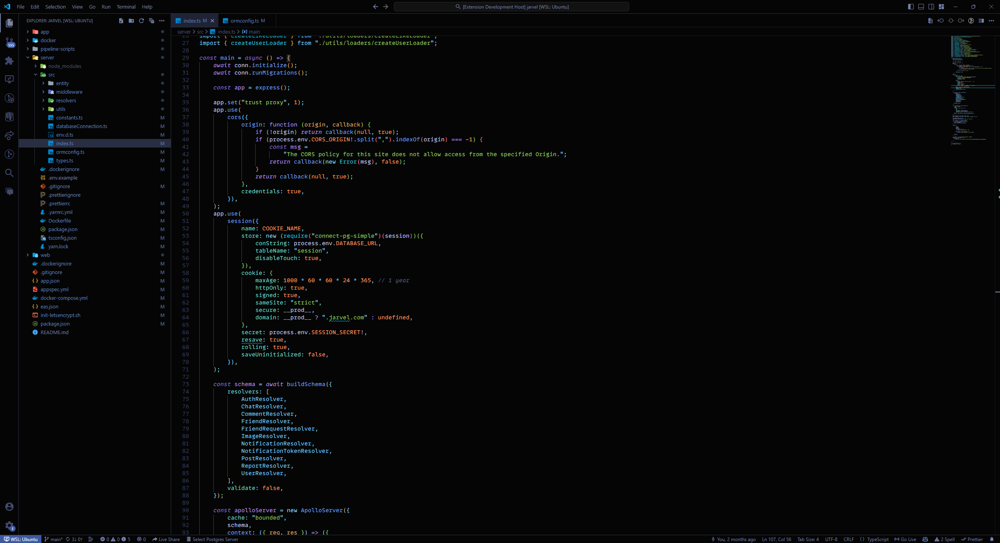

# Jarvel Dark Theme

Jarvel Dark Theme is a dark color theme for Visual Studio Code, inspired by the vibrant nightlife of Tokyo and the calmness of a night storm. It's designed to be easy on the eyes, providing developers with a comfortable and enjoyable coding experience during long coding sessions. This theme emphasizes contrast, readability, and elegance, with carefully chosen colors to highlight key programming constructs.

## Features

- Dark background to reduce eye strain.
- Distinctive colors for different syntax tokens like functions, variables, constants, and more to improve code readability.
- Custom colors for UI elements to ensure a consistent and immersive experience.
- Emphasis on semantic highlighting for better code understanding.

## Preview

## Customization

You can customize the theme further by tweaking the VS Code settings or by using the `workbench.colorCustomizations` and `editor.tokenColorCustomizations` settings in your `settings.json` file.

## Contributing

If you have suggestions or find any issues, please report them on the [GitHub repository](https://github.com/onraj/jarvel-theme/issues), and feel free to submit pull requests.
